# Voxel Space

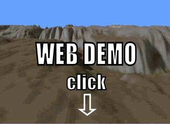

# **[Web Demo of the Voxel Space Engine][project demo]**

## History

Let us go back to the year 1992. The CPUs were 1000 times slower than today and the acceleration via a GPU was unknown or unaffordable. 3D games were calculated exclusively on the CPU and the rendering engine rendered filled polygons with a single color.

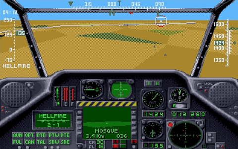
*Game Gunship 2000 published by MicroProse in 1991*

It was during that year [NovaLogic](http://www.novalogic.com/) published the game [Comanche](https://en.wikipedia.org/wiki/Comanche_(video_game_series)).

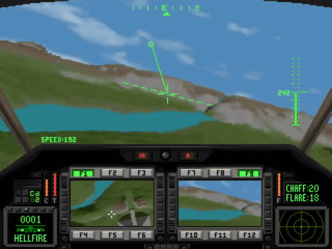
*Game Comanche published by NovaLogic in 1992*

The graphics were breathtaking for the time being and in my opinion 3 years ahead of its time. You see many more details such as textures on mountains and valleys, and for the first time a neat shading and even shadows. Sure, it's pixelated, but all games in those years were pixelated.

## Render algorithm

[Comanche](https://en.wikipedia.org/wiki/Comanche_(video_game_series)) uses a technique called [Voxel Space](https://en.wikipedia.org/wiki/Voxel_Space), which is based on the same ideas like [ray casting](https://en.wikipedia.org/wiki/Ray_casting). Hence the Voxel Space engine is a 2.5D engine, it doesn't have all the levels of freedom that a regular 3D engine offers.

### Height map and color map

The easiest way to represent a terrain is through a height map and color map. For the game Comanche a 1024 \* 1024 one byte height map and a 1024 \* 1024 one byte color map is used which you can download on this site. These maps are periodic:

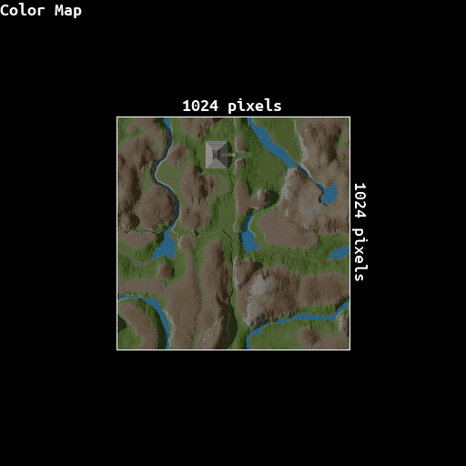

Such maps limit the terrain to "one height per position on the map" - Complex geometries such as buildings or trees are not possible to represent. However, a great advantage of the colormap is, that it already contains the shading and shadows. The Voxel Space engine just takes the color and doesn't have to compute illumination during the render process.

### Basic algorithm
For a 3D engine the rendering algorithm is amazingly simple. The Voxel Space engine rasters the height and color map and draws vertical lines. The following figure demonstrate this technique.

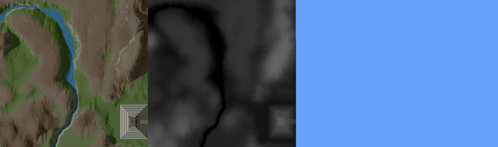

 * Clear Screen.
 * To guarantee occlusion start from the back and render to the front. This is called painter algorithm.
 * Determine the line on the map, which corresponds to the same optical distance from the observer. Consider the field of view and the [perspective projection](https://en.wikipedia.org/wiki/3D_projection) (Objects are smaller farther away)
 * Raster the line so that it matches the number of columns of the screen.
 * Retrieve the height and color from the 2D maps corresponding of the segment of the line.
 * Perform the [perspective projection](https://en.wikipedia.org/wiki/3D_projection) for the height coordinate.
 * Draw a vertical line with the corresponding color with the height retrieved from the perspective projection.

The core algorithm contains in its simplest form only a few lines of code (python syntax):

```python
def Render(p, height, horizon, scale_height, distance, screen_width, screen_height):
    # Draw from back to the front (high z coordinate to low z coordinate)
    for z in range(distance, 1, -1):
        # Find line on map. This calculation corresponds to a field of view of 90°
        pleft  = Point(-z + p.x, -z + p.y)
        pright = Point( z + p.x, -z + p.y)
        # segment the line
        dx = (pright.x - pleft.x) / screen_width
        # Raster line and draw a vertical line for each segment
        for i in range(0, screen_width):
            height_on_screen = (height - heightmap[pleft.x, pleft.y]) / z * scale_height. + horizon
            DrawVerticalLine(i, height_on_screen, screen_height, colormap[pleft.x, pleft.y])
            pleft.x += dx

# Call the render function with the camera parameters:
# position, height, horizon line position,
# scaling factor for the height, the largest distance, 
# screen width and the screen height parameter
Render( Point(0, 0), 50, 120, 120, 300, 800, 600 )
```

### Add rotation

With the algorithm above we can only view to the north. A different angle needs a few more lines of code to rotate the coordinates.

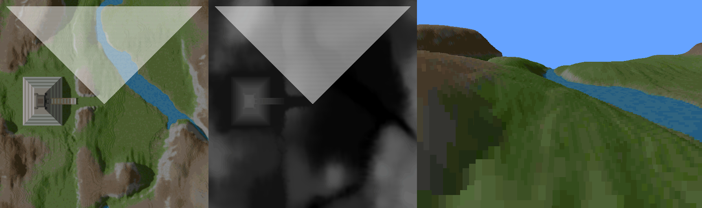

```python
def Render(p, phi, height, horizon, scale_height, distance, screen_width, screen_height):
    # precalculate viewing angle parameters
    var sinphi = math.sin(phi);
    var cosphi = math.cos(phi);

    # Draw from back to the front (high z coordinate to low z coordinate)
    for z in range(distance, 1, -1):

        # Find line on map. This calculation corresponds to a field of view of 90°
        pleft = Point(
            (-cosphi*z - sinphi*z) + p.x,
            ( sinphi*z - cosphi*z) + p.y)
        pright = Point(
            ( cosphi*z - sinphi*z) + p.x,
            (-sinphi*z - cosphi*z) + p.y)
        
        # segment the line
        dx = (pright.x - pleft.x) / screen_width
        dy = (pright.y - pleft.y) / screen_width

        # Raster line and draw a vertical line for each segment
        for i in range(0, screen_width):
            height_on_screen = (height - heightmap[pleft.x, pleft.y]) / z * scale_height. + horizon
            DrawVerticalLine(i, height_on_screen, screen_height, colormap[pleft.x, pleft.y])
            pleft.x += dx
            pleft.y += dy

# Call the render function with the camera parameters:
# position, viewing angle, height, horizon line position, 
# scaling factor for the height, the largest distance, 
# screen width and the screen height parameter
Render( Point(0, 0), 0, 50, 120, 120, 300, 800, 600 )
```

### More performance

There are of course a lot of tricks to achieve higher performance.

* Instead of drawing from back to the front we can draw from front to back. The advantage is, the we don't have to draw lines to the bottom of the screen every time because of occlusion. However, to guarantee occlusion we need an additional y-buffer. For every column, the highest y position is stored. Because we are drawing from the front to back, the visible part of the next line can only be larger then the highest line previously drawn.
* Level of Detail. Render more details in front but less details far away. 

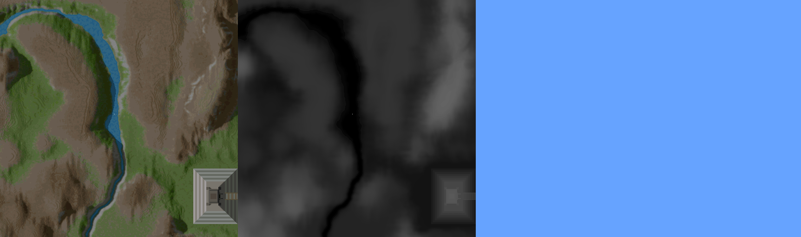

```python
def Render(p, phi, height, horizon, scale_height, distance, screen_width, screen_height):
    # precalculate viewing angle parameters
    var sinphi = math.sin(phi);
    var cosphi = math.cos(phi);
    
    # initialize visibility array. Y position for each column on screen 
    ybuffer = np.zeros(screen_width)
    for i in range(0, screen_width):
        ybuffer[i] = screen_height

    # Draw from front to the back (low z coordinate to high z coordinate)
    dz = 1.
    z = 1.
    while z < distance
        # Find line on map. This calculation corresponds to a field of view of 90°
        pleft = Point(
            (-cosphi*z - sinphi*z) + p.x,
            ( sinphi*z - cosphi*z) + p.y)
        pright = Point(
            ( cosphi*z - sinphi*z) + p.x,
            (-sinphi*z - cosphi*z) + p.y)

        # segment the line
        dx = (pright.x - pleft.x) / screen_width
        dy = (pright.y - pleft.y) / screen_width

        # Raster line and draw a vertical line for each segment
        for i in range(0, screen_width):
            height_on_screen = (height - heightmap[pleft.x, pleft.y]) / z * scale_height. + horizon
            DrawVerticalLine(i, height_on_screen, ybuffer[i], colormap[pleft.x, pleft.y])
            if height_on_screen < ybuffer[i]:
                ybuffer[i] = height_on_screen
            pleft.x += dx
            pleft.y += dy

        # Go to next line and increase step size when you are far away
        z += dz
        dz += 0.2

# Call the render function with the camera parameters:
# position, viewing angle, height, horizon line position, 
# scaling factor for the height, the largest distance, 
# screen width and the screen height parameter
Render( Point(0, 0), 0, 50, 120, 120, 300, 800, 600 )
```

## Links

[Web Project demo][project demo] page

[Voxel terrain engine - an introduction](https://web.archive.org/web/20131113094653/http://www.codermind.com/articles/Voxel-terrain-engine-building-the-terrain.html)

[Personal website](http://www.simulationcorner.net)


## Maps
[color](maps/C1W.png),
[height](maps/D1.png)


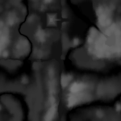

[color](maps/C2W.png),
[height](maps/D2.png)

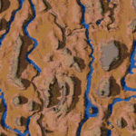
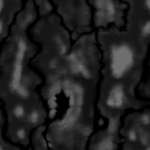

[color](maps/C3.png),
[height](maps/D3.png)

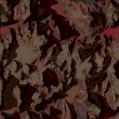
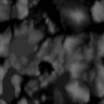

[color](maps/C4.png),
[height](maps/D4.png)

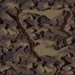
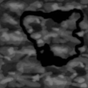

[color](maps/C5W.png),
[height](maps/D5.png)

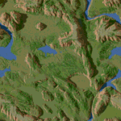
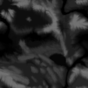

[color](maps/C6W.png),
[height](maps/D6.png)

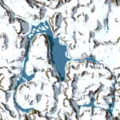


[color](maps/C7W.png),
[height](maps/D7.png)

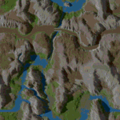
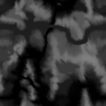

[color](maps/C8.png),
[height](maps/D6.png)

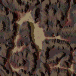


[color](maps/C9W.png),
[height](maps/D9.png)

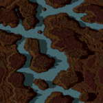


[color](maps/C10W.png),
[height](maps/D10.png)

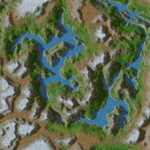
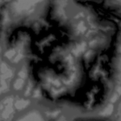

[color](maps/C11W.png),
[height](maps/D11.png)

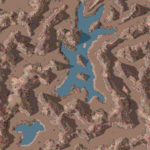
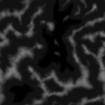

[color](maps/C12W.png),
[height](maps/D11.png)

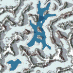


[color](maps/C13.png),
[height](maps/D13.png)

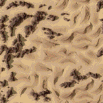
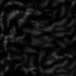

[color](maps/C14.png),
[height](maps/D14.png)


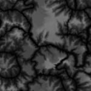

[color](maps/C14W.png),
[height](maps/D14.png)

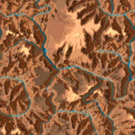


[color](maps/C15.png),
[height](maps/D15.png)

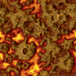
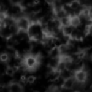

[color](maps/C16W.png),
[height](maps/D16.png)

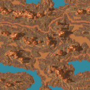
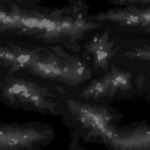

[color](maps/C17W.png),
[height](maps/D17.png)

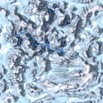
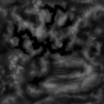

[color](maps/C18W.png),
[height](maps/D18.png)

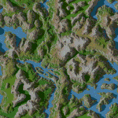
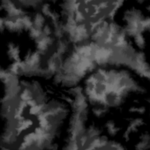

[color](maps/C19W.png),
[height](maps/D19.png)

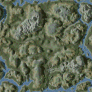
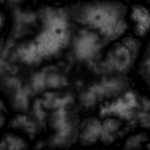

[color](maps/C20W.png),
[height](maps/D20.png)

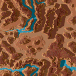
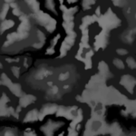

[color](maps/C21.png),
[height](maps/D21.png)

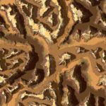


[color](maps/C22W.png),
[height](maps/D22.png)

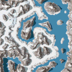
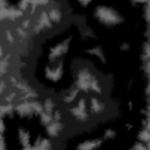

[color](maps/C23W.png),
[height](maps/D21.png)

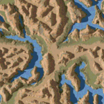


[color](maps/C24W.png),
[height](maps/D24.png)


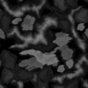

[color](maps/C25W.png),
[height](maps/D25.png)

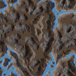


[color](maps/C26W.png),
[height](maps/D18.png)

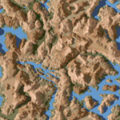


[color](maps/C27W.png),
[height](maps/D15.png)

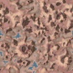


[color](maps/C28W.png),
[height](maps/D25.png)


[color](maps/C29W.png),
[height](maps/D16.png)


## License

The software part of the repository is under the MIT license. Please read the license file for more information. Please keep in mind, that the Voxel Space technology might be still [patented](https://patents.justia.com/assignee/novalogic-inc) in some countries. The color and height maps are reverse engineered from the game Comanche and are therefore excluded from the license.

[project demo]: https://s-macke.github.io/VoxelSpace/VoxelSpace.html
